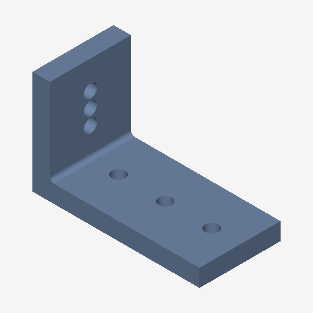
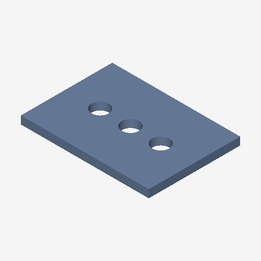

# KAIROS

**Knowledge-Augmented Interactive Reinforcement Optimization System**

KAIROS is a research prototype for **sequential geometric decision-making**: an
embodied multimodal agent that learns to perform sequences of parametric CAD
operations that optimize engineering designs under geometric, manufacturing,
and performance constraints.

> **Research question.** Can an embodied multimodal agent learn to perform
> sequences of parametric CAD operations that optimize engineering designs
> under geometric, manufacturing, and performance constraints?

The system combines reinforcement learning, vision-language-action modeling,
parametric CAD (FreeCAD), computational geometry, constrained optimization,
and engineering surrogate modeling.

## Architecture (target)

```text
User requirement → Language parser → Engineering specification
                                            │
        CAD graph + rendered views + history + numerics + text
                                            │
                                  Multimodal CAD encoder
                                            │
                                  Hierarchical VLA policy
                                            │
                              Structured CAD action (no free code)
                                            │
                                     FreeCAD engine
                                            │
                       Observation → Reward model → RL environment ─┐
                                            ▲                       │
                                            └───────────────────────┘
```

## Sample procedural designs

Generated by `make generate-data` and rendered headlessly by the built-in
software rasterizer (no GUI, no external renderer):

| L-bracket (2×3 holes, corner fillet) | Mounting plate (3×1 grid) |
| --- | --- |
|  |  |

## Dataset

1,080 validated designs across 8 procedural families, each with a rendered
solid, a STEP/STL export, and a reward-annotated expert trajectory checked
against its own natural-language requirement. See
[docs/dataset.md](docs/dataset.md) for the full breakdown.

```bash
scripts/generate_dataset.sh dataset 135   # 8 shards, fixed seeds, then audits
python3 scripts/audit_dataset.py --root dataset --fix
python3 scripts/dataset_stats.py --root dataset --out docs/dataset.md
```

The shard seeds are recorded in `dataset/manifest.json`, and the run resumes
rather than restarting if it is interrupted.

## Project status

Development proceeds in phases (see `docs/`):

- [x] **Phase 1 — CAD backend**: FreeCAD wrapper, structured action API,
      geometry validation, procedural bracket generation.
- [x] **Phase 2 — Procedural dataset**: 8 design families, 1,000+ validated
      designs with reward-annotated expert trajectories.
- [x] **Phase 3 — CAD representation**: geometry graph, observation
      snapshots, numerical/feature encoders, rendered views.
- [ ] Phase 4 — Multimodal VLA + behavioral cloning
- [~] Phase 5 — RL: Gymnasium env, shaped reward, action masking done; PPO
      training pending
- [ ] Phase 6 — Engineering optimization + learned surrogate
- [ ] Phase 7 — KAIROS-CAD benchmark, baselines, ablations
- [ ] Phase 8 — Interactive Three.js dashboard
- [ ] Phase 9 — Paper (NeurIPS 2026 format)

## Requirements

- Python ≥ 3.10
- [FreeCAD](https://www.freecad.org/) ≥ 0.21 (1.x recommended)

FreeCAD is **not** pip-installable. KAIROS locates an installed FreeCAD and
imports its Python modules (see `kairos/cad/backend.py` and
`docs/freecad-setup.md`). On macOS the simplest route:

```bash
brew install --cask freecad
```

The CAD-dependent code and tests must run under FreeCAD's bundled
interpreter; the `Makefile` resolves this automatically:

```bash
make setup       # install dev deps
make test        # pure-python tests (schema, masking, planning)
make test-cad    # CAD integration tests under FreeCAD's python
make generate-data  # procedural bracket dataset
```

## Design principles

- The agent never emits arbitrary code — every operation is a **structured
  action** validated against a typed parameter schema before execution.
- Every generated model is **validated** (solid validity, closed shells,
  volume, feature errors) before entering any dataset.
- Experiments are configured by YAML, seeded, and tracked; results are never
  hand-edited.

## License

MIT — see [LICENSE](LICENSE).
